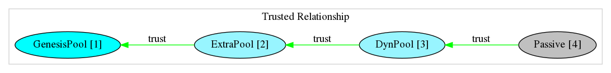
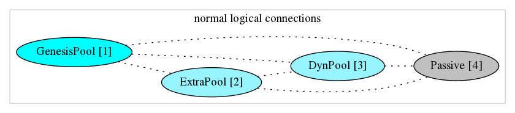
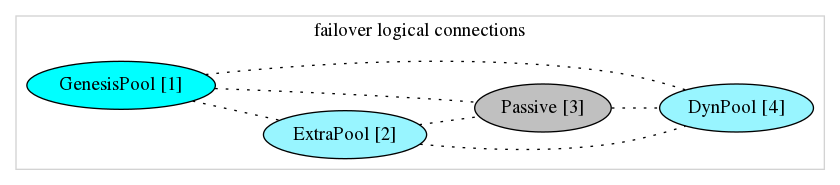

# jorcli_examples

[](https://goreportcard.com/report/github.com/rinor/jorcli_examples)
[](LICENSE)

## Networked examples

1) [node_genesis_bootstrap_and_run](#genesis-node-bootstrap-and-run)
2) [node_genesis_stakepool_run](#genesis-stakepool-node-run)
3) [node_stakepool_create_and_run](#stakepool-node-create-and-run)
4) [node_passive_run](#passive-node-run)

Here are some visuals related to the network.

This shows how **trusted** relationship is configured.



This shows the network logical connections, once the network is up and running.



- **GenesisPool [1]** connections ("nodeId": "111111111111111111111111111111111111111111111111")

```json
jcli rest v0 network stats get --host http://127.0.0.11:8001/api --output-format json
[
  {
    "establishedAt": "2019-11-19T12:23:30.282120786+00:00",
    "lastBlockReceived": "2019-11-19T12:27:52.232801259+00:00",
    "lastFragmentReceived": "2019-11-19T12:23:37.847038807+00:00",
    "lastGossipReceived": "2019-11-19T12:28:00.275696973+00:00",
    "nodeId": "444444444444444444444444444444444444444444444444"
  },
  {
    "establishedAt": "2019-11-19T12:23:00.756612095+00:00",
    "lastBlockReceived": "2019-11-19T12:27:52.234610630+00:00",
    "lastFragmentReceived": "2019-11-19T12:23:37.846877002+00:00",
    "lastGossipReceived": "2019-11-19T12:28:00.745317438+00:00",
    "nodeId": "222222222222222222222222222222222222222222222222"
  },
  {
    "establishedAt": "2019-11-19T12:23:13.794298990+00:00",
    "lastBlockReceived": "2019-11-19T12:27:52.210200819+00:00",
    "lastFragmentReceived": "2019-11-19T12:23:37.844587305+00:00",
    "lastGossipReceived": "2019-11-19T12:28:05.805038794+00:00",
    "nodeId": "333333333333333333333333333333333333333333333333"
  }
]
```

- **ExtraPool [2]** connections ("nodeId": "222222222222222222222222222222222222222222222222")

```json
jcli rest v0 network stats get --host http://127.0.0.22:8001/api --output-format json
[
  {
    "establishedAt": "2019-11-19T12:23:30.281435816+00:00",
    "lastBlockReceived": "2019-11-19T12:27:52.233341195+00:00",
    "lastFragmentReceived": "2019-11-19T12:23:37.846762448+00:00",
    "lastGossipReceived": "2019-11-19T12:28:00.273772420+00:00",
    "nodeId": "444444444444444444444444444444444444444444444444"
  },
  {
    "establishedAt": "2019-11-19T12:23:00.737683470+00:00",
    "lastBlockReceived": "2019-11-19T12:27:52.090768692+00:00",
    "lastFragmentReceived": "2019-11-19T12:23:37.847920078+00:00",
    "lastGossipReceived": "2019-11-19T12:28:03.795978344+00:00",
    "nodeId": "111111111111111111111111111111111111111111111111"
  },
  {
    "establishedAt": "2019-11-19T12:23:05.808776408+00:00",
    "lastBlockReceived": "2019-11-19T12:27:52.210384689+00:00",
    "lastFragmentReceived": "2019-11-19T12:23:37.844164826+00:00",
    "lastGossipReceived": "2019-11-19T12:28:05.804323596+00:00",
    "nodeId": "333333333333333333333333333333333333333333333333"
  }
]
```

- **DynPool [3]** connections ("nodeId": "333333333333333333333333333333333333333333333333")

```json
jcli rest v0 network stats get --host http://127.0.0.33:8001/api --output-format json
[
  {
    "establishedAt": "2019-11-19T12:23:10.278650827+00:00",
    "lastBlockReceived": "2019-11-19T12:27:52.232436509+00:00",
    "lastFragmentReceived": "2019-11-19T12:23:37.847790747+00:00",
    "lastGossipReceived": "2019-11-19T12:28:00.273948518+00:00",
    "nodeId": "444444444444444444444444444444444444444444444444"
  },
  {
    "establishedAt": "2019-11-19T12:23:05.797814243+00:00",
    "lastBlockReceived": "2019-11-19T12:27:52.234880376+00:00",
    "lastFragmentReceived": "2019-11-19T12:23:37.847661802+00:00",
    "lastGossipReceived": "2019-11-19T12:28:00.745085256+00:00",
    "nodeId": "222222222222222222222222222222222222222222222222"
  },
  {
    "establishedAt": "2019-11-19T12:23:13.803491055+00:00",
    "lastBlockReceived": "2019-11-19T12:27:52.090539917+00:00",
    "lastFragmentReceived": "2019-11-19T12:23:37.849475605+00:00",
    "lastGossipReceived": "2019-11-19T12:28:03.797006969+00:00",
    "nodeId": "111111111111111111111111111111111111111111111111"
  }
]
```

- **Passive [4]** connections ("nodeId": "444444444444444444444444444444444444444444444444")

```json
jcli rest v0 network stats get --host http://127.0.0.44:8001/api --output-format json
[
  {
    "establishedAt": "2019-11-19T12:23:30.271379244+00:00",
    "lastBlockReceived": "2019-11-19T12:27:52.236176119+00:00",
    "lastFragmentReceived": "2019-11-19T12:23:37.848497938+00:00",
    "lastGossipReceived": "2019-11-19T12:28:00.744560524+00:00",
    "nodeId": "222222222222222222222222222222222222222222222222"
  },
  {
    "establishedAt": "2019-11-19T12:23:30.272899607+00:00",
    "lastBlockReceived": "2019-11-19T12:27:52.090646466+00:00",
    "lastFragmentReceived": "2019-11-19T12:23:37.846851695+00:00",
    "lastGossipReceived": "2019-11-19T12:28:03.796098010+00:00",
    "nodeId": "111111111111111111111111111111111111111111111111"
  },
  {
    "establishedAt": "2019-11-19T12:23:10.268009846+00:00",
    "lastBlockReceived": "2019-11-19T12:27:52.210187085+00:00",
    "lastFragmentReceived": "2019-11-19T12:23:37.844299546+00:00",
    "lastGossipReceived": "2019-11-19T12:28:05.805473715+00:00",
    "nodeId": "333333333333333333333333333333333333333333333333"
  }
]
```

### **TBD**

This shows an *attempt* that will try to move **live** an active pool ( **DynPool** ) to another passive node ( **Passive** ),
once the network is up and running.

**FROM**:


**TO**:



## Interacting tools examples

1) [jcli_rest_v0](#jcli-rest-v0)
2) [jcli_bulk_send_sequential](#jcli-bulk-send-sequential)
3) [jcli_bulk_send_concurrent](#jcli-bulk-send-concurrent) - TBD

## Genesis Node Bootstrap And Run

Bootstrap configuration and start a **leader** node with and active local stake pool.

It shows the usage of:

- [jcli](https://godoc.org/github.com/rinor/jorcli/jcli)
- [jnode](https://godoc.org/github.com/rinor/jorcli/jnode)

### Info Genesis Node

```log
2019/11/19 12:22:44 Using: jcli 0.7.0 (master-74310fd9, debug, linux [x86_64]) - [rustc 1.39.0 (4560ea788 2019-11-04)]
2019/11/19 12:22:45 Using: jormungandr 0.7.0 (master-d0070faa, debug, linux [x86_64]) - [rustc 1.39.0 (4560ea788 2019-11-04)]
2019/11/19 12:22:45
2019/11/19 12:22:45 Working Directory: /tmp/jnode_genesis_502607293
2019/11/19 12:22:52
2019/11/19 12:22:52 Genesis Hash: 46bc7d8a8c1f3752a062db38970f982721631e41512943afaf6ff6faa7631c10
2019/11/19 12:22:52
2019/11/19 12:22:52 LOCAL StakePool ID       : d2db96cacc16f5dbbb943e96b4f649af4352a57c19946b223d6e4bd8ff39f10f
2019/11/19 12:22:52 LOCAL StakePool Owner    : ca1shz8a85d3xhu76n0k9s99ss8v69nf8dnqagly4ljndzr9pqyg6ktu7kyv3v
2019/11/19 12:22:52 LOCAL StakePool Owner    : ca1sk6pmqy3lfrr7kq4afmywn5hl9prurwy7xfqejjgazlg9r5nnmk26h5fr8k
2019/11/19 12:22:52 LOCAL StakePool Delegator: ca1shz8a85d3xhu76n0k9s99ss8v69nf8dnqagly4ljndzr9pqyg6ktu7kyv3v
2019/11/19 12:22:52 LOCAL StakePool Delegator: ca1sk6pmqy3lfrr7kq4afmywn5hl9prurwy7xfqejjgazlg9r5nnmk26h5fr8k
2019/11/19 12:22:52
2019/11/19 12:22:52 EXTRA StakePool ID       : cdf33396d480dcc5915cf34163b7006a623e8f77e7d9f47c197d6e72119a0e51
2019/11/19 12:22:52 EXTRA StakePool Owner    : ca1s5rkmsfsra5chatzcjmdmh5nsu8rpar6x2ly3gr85q332ckr4quqvlpscpr
2019/11/19 12:22:52 EXTRA StakePool Delegator: ca1s5rkmsfsra5chatzcjmdmh5nsu8rpar6x2ly3gr85q332ckr4quqvlpscpr
2019/11/19 12:22:52
2019/11/19 12:22:52 NodePublicID for trusted: 111111111111111111111111111111111111111111111111
2019/11/19 12:22:52
2019/11/19 12:22:52 Genesis Node - Running...
```

## Genesis Stakepool Node Run

Configure and start the extra stake pool already encoded in genesis node.

- `--genesis-block-hash` from [node_genesis_bootstrap_and_run](#genesis-node-bootstrap-and-run)
- `--secret` self generate pool secrets (related to the extra pool encoded in genesis block0)
- `--trusted-peer` the node from [node_genesis_bootstrap_and_run](#genesis-node-bootstrap-and-run)

It shows the usage of:

- [jcli](https://godoc.org/github.com/rinor/jorcli/jcli)
- [jnode](https://godoc.org/github.com/rinor/jorcli/jnode)

### Info Genesis Stakepol Node

```log
2019/11/19 12:22:58 Using: jcli 0.7.0 (master-74310fd9, debug, linux [x86_64]) - [rustc 1.39.0 (4560ea788 2019-11-04)]
2019/11/19 12:22:58 Using: jormungandr 0.7.0 (master-d0070faa, debug, linux [x86_64]) - [rustc 1.39.0 (4560ea788 2019-11-04)]
2019/11/19 12:22:58
2019/11/19 12:22:58 Working Directory: /tmp/jnode_gepstake_142244126
2019/11/19 12:23:00
2019/11/19 12:23:00 Genesis Hash: 46bc7d8a8c1f3752a062db38970f982721631e41512943afaf6ff6faa7631c10
2019/11/19 12:23:00
2019/11/19 12:23:00 StakePool ID       : cdf33396d480dcc5915cf34163b7006a623e8f77e7d9f47c197d6e72119a0e51
2019/11/19 12:23:00 StakePool Owner    : ca1s5rkmsfsra5chatzcjmdmh5nsu8rpar6x2ly3gr85q332ckr4quqvlpscpr
2019/11/19 12:23:00 StakePool Delegator: ca1s5rkmsfsra5chatzcjmdmh5nsu8rpar6x2ly3gr85q332ckr4quqvlpscpr
2019/11/19 12:23:00
2019/11/19 12:23:00 NodePublicID for trusted: 222222222222222222222222222222222222222222222222
2019/11/19 12:23:00
2019/11/19 12:23:00 Genesis StakePool Node - Running...
```

## StakePool Node Create And Run

Creates a StakePool node with appropriate configuration,
register it to the network, delegate to it and run:

- `--genesis-block-hash` from [node_genesis_bootstrap_and_run](#genesis-node-bootstrap-and-run)
- `--secret` self generate pool secrets
- `--trusted-peer` the node from [node_genesis_stakepool_run](#genesis-stakepool-node-run)

It shows the usage of:

- [jcli](https://godoc.org/github.com/rinor/jorcli/jcli)
- [jnode](https://godoc.org/github.com/rinor/jorcli/jnode)

### Info StakePool Node

```log
2019/11/19 12:23:03 Using: jcli 0.7.0 (master-74310fd9, debug, linux [x86_64]) - [rustc 1.39.0 (4560ea788 2019-11-04)]
2019/11/19 12:23:03 Using: jormungandr 0.7.0 (master-d0070faa, debug, linux [x86_64]) - [rustc 1.39.0 (4560ea788 2019-11-04)]
2019/11/19 12:23:03
2019/11/19 12:23:03 Working Directory: /tmp/jnode_dynstake_082324341
2019/11/19 12:23:03
2019/11/19 12:23:05 Waiting for rest interface...
2019/11/19 12:23:06 ...Node state [Running]
2019/11/19 12:23:06 SelfTip: 46bc7d8a8c1f3752a062db38970f982721631e41512943afaf6ff6faa7631c10
2019/11/19 12:23:06 Wait for pool registration certificate transaction [ffe6082ecb5179a4f8a80fb0afde2b3edf5276edca54e49c6705f7c336d746da] status change...
2019/11/19 12:23:37 FragmentID: ffe6082ecb5179a4f8a80fb0afde2b3edf5276edca54e49c6705f7c336d746da - InABlock [225076.108 (8547fe0b2f078e784040b6fd7bad6a6dac8301671f7f5ab1a711075243475dff)]
2019/11/19 12:23:37 Wait for delegation certificate transaction [d4c7546f85839670b85cd68c78da23be9f667bae251c67633043ba8fb2c250c9] status change...
2019/11/19 12:23:56 FragmentID: d4c7546f85839670b85cd68c78da23be9f667bae251c67633043ba8fb2c250c9 - InABlock [225076.118 (9b97ef2bf0e7fb8b76cd42f96bb5e1e900d0c21bda1bb2f6bfa27f230f772872)]
2019/11/19 12:23:56
2019/11/19 12:23:56 Genesis Hash: 46bc7d8a8c1f3752a062db38970f982721631e41512943afaf6ff6faa7631c10
2019/11/19 12:23:56
2019/11/19 12:23:56 StakePool ID       : a6dd0593614b1fe7e8d9b45d64798f4a436193632f8c8e7001e9ac77a566654c
2019/11/19 12:23:56 StakePool Owner    : ca1shz8a85d3xhu76n0k9s99ss8v69nf8dnqagly4ljndzr9pqyg6ktu7kyv3v
2019/11/19 12:23:56 StakePool Owner    : ca1sk6pmqy3lfrr7kq4afmywn5hl9prurwy7xfqejjgazlg9r5nnmk26h5fr8k
2019/11/19 12:23:56 StakePool Delegator: ca1s5a8e4qye5rwttc9qrek0e30htttmpvvuf967mdp35pcx80t6e2pststymr
2019/11/19 12:23:56
2019/11/19 12:23:56 NodePublicID for trusted: 333333333333333333333333333333333333333333333333
2019/11/19 12:23:56
2019/11/19 12:23:56 Delegator StakePool Node - Running...
```

## Passive Node Run

Start a passive node with:

- `--genesis-block-hash` from [node_genesis_bootstrap_and_run](#genesis-node-bootstrap-and-run)
- `--trusted-peer` the node from [node_stakepool_create_and_run](#stakepool-node-create-and-run)

It shows the usage of:

- [jnode](https://godoc.org/github.com/rinor/jorcli/jnode)

### Info Passive Node

```log
2019/11/19 12:23:09 Using: jcli 0.7.0 (master-74310fd9, debug, linux [x86_64]) - [rustc 1.39.0 (4560ea788 2019-11-04)]
2019/11/19 12:23:09 Using: jormungandr 0.7.0 (master-d0070faa, debug, linux [x86_64]) - [rustc 1.39.0 (4560ea788 2019-11-04)]
2019/11/19 12:23:09
2019/11/19 12:23:09 Working Directory: /tmp/jnode_passive_826200390
2019/11/19 12:23:09
2019/11/19 12:23:09 Genesis Hash: 46bc7d8a8c1f3752a062db38970f982721631e41512943afaf6ff6faa7631c10
2019/11/19 12:23:09
2019/11/19 12:23:09 NodePublicID for trusted: 444444444444444444444444444444444444444444444444
2019/11/19 12:23:09
2019/11/19 12:23:09 Passive/Explorer Node - Running...
```

## JCLI Rest v0

Query the node using rest capabilies of `jcli`.

It shows the usage of:

- [jcli](https://godoc.org/github.com/rinor/jorcli/jcli)

## JCLI Bulk send sequential

Bulk send 100 transaction to 1 address (delegator address).
This is a sequential version in order not to stress too much the rest interface.

It shows the usage of:

- [jcli](https://godoc.org/github.com/rinor/jorcli/jcli)

Inside `accounts` folder it will create a list of files with all addresses involved in the transactions.

Ex: `delegator_ca1s5a8e4qye5rwttc9qrek0e30htttmpvvuf967mdp35pcx80t6e2pststymr.json`

```json
{
  "Discrimination": "testing",
  "KeySeed": "0000000000000000000000000000000000000000000000000000000000003630",
  "KeyType": "Ed25519Extended",
  "PrivateKey": "ed25519e_sk14p7dd8ldnms4jtntra6dnezmp72597vsdz54hxww9v9npyuaa3prwp9c5klcuh7vlnfxp27gpmhm8khksdyz0qs6g9zvswddfcy8e6q8h68a7",
  "PublicKey": "ed25519_pk18f7dgpxdqmj67pgq7dn7vta6667ctr8zfwhkmgvdqwp3m67k2svq4yrsrd",
  "Account": "ca1s5a8e4qye5rwttc9qrek0e30htttmpvvuf967mdp35pcx80t6e2pststymr",
  "Single": "ca1sva8e4qye5rwttc9qrek0e30htttmpvvuf967mdp35pcx80t6e2ps9qw532",
  "Group": "ca1ssa8e4qye5rwttc9qrek0e30htttmpvvuf967mdp35pcx80t6e2pswnu6szv6ph94uzspum8uchm444askxwyja0dksc6qurrh4av4qce9ge5t",
  "GroupWith": "ed25519_pk18f7dgpxdqmj67pgq7dn7vta6667ctr8zfwhkmgvdqwp3m67k2svq4yrsrd"
}
```

Ex: `ca1skjryzc2x6a4dwpxmkygznf3czvpcmuequ9gqca0hcufqp87vw5a5lhlmtt.json`

```json
{
  "Discrimination": "testing",
  "KeySeed": "0000000000000000000000000000000000000000000000000000000000313030",
  "KeyType": "Ed25519Extended",
  "PrivateKey": "ed25519e_sk1yqn83ds5fclzht9fv52a2kflc2dul0sqwjw9k4uh4t44lzlgn3zm64c7vk5h6l0m8vmgvws40ac45rwhyw4v8capfxfx2nx9ys82gqcp4ccnf",
  "PublicKey": "ed25519_pk15seqkz3khdttsfka3zq56vwqnqwxlxg8p2qx8ta78zgqflnr48dqgyhjf6",
  "Account": "ca1skjryzc2x6a4dwpxmkygznf3czvpcmuequ9gqca0hcufqp87vw5a5lhlmtt",
  "Single": "ca1swjryzc2x6a4dwpxmkygznf3czvpcmuequ9gqca0hcufqp87vw5a5386tpz"
}
```

Example log showing first the **account address** - **spending counter** - **account balance**

```log
2019/11/19 12:58:29 ca1skjryzc2x6a4dwpxmkygznf3czvpcmuequ9gqca0hcufqp87vw5a5lhlmtt - 0 - 50000000000000
2019/11/19 12:58:29 ca1s4pmyagmqdanyfjtdrz9jj8jrf84dyqhnf2w67man3xlspt842cquv7940z - 0 - 50000000000000
2019/11/19 12:58:30 ca1sk9ydx0xy3q4pz477yfc2gx33vlgepa0zjqdujmsm83n4zx8xwn4yjjt3me - 0 - 50000000000000
2019/11/19 12:58:30 ca1s53w0sa28fw0ykreyw7nyclgl3rjprw7mkccpk084k8rmg7un474gtw8fuj - 0 - 50000000000000
2019/11/19 12:58:30 ca1sh2xfzwxrqlxal6vnmhqtzkm3k4nvum8rlk3fd2ksudpk0las3946pmneak - 0 - 50000000000000
2019/11/19 12:58:30 ca1s47g6peqfzfxmhzhc07xqrlhqmq3f0q24v6nr8a42lqduegtj9kvcjsmzp8 - 0 - 50000000000000
2019/11/19 12:58:30 ca1s4gnnljx4wa7rfxr0swxqln4wg9s4vj8kt3xsa5djmya984zea5h2spvg8z - 0 - 50000000000000
2019/11/19 12:58:30 ca1s5au5mf0axuppq9qsfe90kwne0jjtjdkh93pmfplap56yue24kvz6rej7e9 - 0 - 50000000000000
2019/11/19 12:58:30 ca1s47zzz8nrwww9z4w2yl9d3yjckxap6dyd5u27pryuyk8vpje0jkzjesjqqf - 0 - 50000000000000
2019/11/19 12:58:30 ca1s4cca439qvt7dazppu9uuvl8xpwf45dtxqmh2q3wgxr8tx4hjg2wyvtty2g - 0 - 50000000000000
2019/11/19 12:58:31 ca1s5xlflm5ytzvzhr6p6m9gj2qlw03g20qwdgwxnsv2ll4kj0jthvgzn0uv6f - 0 - 50000000000000
2019/11/19 12:58:31 ca1shhagrmnc2d2gc89me7el5d57706e8vmvm35wd277u9tq7tnqu9j7733y6e - 0 - 50000000000000
2019/11/19 12:58:31 ca1s4dd2fkla3deusgweywzge9t0cetm064kllf9gsfvtfpc9nfs7sgcn0428c - 0 - 50000000000000
2019/11/19 12:58:31 ca1skkf06ftnlexqwvx0fzgs82vqnrnm9s84adhr89wu5q0ly3at5xuxseejf9 - 0 - 50000000000000
2019/11/19 12:58:31 ca1s4mtn4jmefk00qfmv7j3t6vesqunarnsmht9herk7yuf8x4mzs8czsd0qzn - 0 - 50000000000000
2019/11/19 12:58:31 ca1shldwftcpng0ah3kzrc7ufzl39uafsjkrmk8yu7cum05r9fuslj65kcm5t4 - 0 - 50000000000000
2019/11/19 12:58:31 ca1shykqlluq8ass3kgj5zalhrmwlf4d2qd4lam5rhsgcw2urjy8rwpcpxhflw - 0 - 50000000000000
2019/11/19 12:58:31 ca1s49dckh3gqtfzqrfe5t4x93j6kzhq4ssuc9zfdk5fdwfd6gat8c4j3qpes2 - 0 - 50000000000000
2019/11/19 12:58:32 ca1sk4l6zqcc4tgsfp0akeknpkd35jrrsz97827z35mg36wrc6fumhxw0dah8k - 0 - 50000000000000
2019/11/19 12:58:32 ca1skxqlkz49rrnpwd3heapa76rnrp2adent77w4asrq4sayw3wwpp9jj7n8qn - 0 - 50000000000000
2019/11/19 12:58:32 ca1sh8jfxjgtmdym04x3tr0tzugxw0a7hqsj0ydr40xt2rz69hsxy99g5a72ey - 0 - 50000000000000
2019/11/19 12:58:32 ca1s4yvyn93sjmr7e7rlr8r4qsq76mfrr5mpumqq8vvzur33uergnu8u8trrn3 - 0 - 50000000000000
2019/11/19 12:58:32 ca1s5hpjd5uy5npu6d6pc7kycz3pawkzd9m6kau3kq20mq2easv5pfyjuf2m6p - 0 - 50000000000000
2019/11/19 12:58:32 ca1skuwg6kam9wlckh7kzrlul4fq022nfr52rdzd0094550wkmr2ydk7ehda5m - 0 - 50000000000000
2019/11/19 12:58:32 ca1s550tzlpy3xhlezde72cwn70xg94924k04luw5nkxfgwhdkf0e9g27q0fla - 0 - 50000000000000
2019/11/19 12:58:32 ca1skfys5mtl9w5chu7dlk7f0p3xtqrvauhw866ykg6jmevtjkdmumj67klx95 - 0 - 50000000000000
2019/11/19 12:58:32 ca1s5jvr7hehcme4hlgp0jl30s0jhl0hhl3lm7h406s50u65t7c3myvkdef7y3 - 0 - 50000000000000
2019/11/19 12:58:33 ca1s5gmt78jszdcjthq5snrawgyf4rycdjcfkvfkjnxx437pzkvxkxrwd3h882 - 0 - 50000000000000
2019/11/19 12:58:33 ca1sh8fjw43kxwzmu6stas4rw4fvsgwd9mtnrdhykdas6833nu05ex6s4q58yf - 0 - 50000000000000
2019/11/19 12:58:33 ca1skzlvder8cv6fsnuxqm6dkrgra97py2jprkxcgdzlrmu5m6yglvnxtuqnc0 - 0 - 50000000000000
2019/11/19 12:58:33 ca1sk66alarl3xqklwee22xe07kpxxs94nh96r37ye4dl6uwh96zf0m73n95eg - 0 - 50000000000000
2019/11/19 12:58:33 ca1sh4rm259rqpuazujn7z7l3d5hcwymgum97g2c4453cnvpmg8athk5kgx9d2 - 0 - 50000000000000
2019/11/19 12:58:33 ca1s4y5wz08tcfv8xdmdqkf5knxnm7qk9snft3g045txswvycc3vq2m70l70a5 - 0 - 50000000000000
2019/11/19 12:58:33 ca1s55zzdkw3r95hdsym29vvlacan40we90pqu5vrempuz0x48cw7tqqtgzpdl - 0 - 50000000000000
2019/11/19 12:58:33 ca1s43ymn68j9yq6gmdmt745tfdj8pee8ct02qmd9zmd2d3chc6m3dqwcqh9pj - 0 - 50000000000000
2019/11/19 12:58:34 ca1skng9thtxeyxkn8hg4038q423e2wkhzym4c3t87hsk5tghtfc7hlyflh489 - 0 - 50000000000000
2019/11/19 12:58:34 ca1s5jp5xhmqqv2uyzdnx2ge4tsdkxs7gqvy956trtjl2c0fhnkudl6g6n642a - 0 - 50000000000000
2019/11/19 12:58:34 ca1sk59zz4klx6j8md78246rqhk8q0gnnp6gj4qje94yr2c24ggrswgwma0rwg - 0 - 50000000000000
2019/11/19 12:58:34 ca1s45xm9nryk8nxdfhvznjuxdav842muqr8c0czntj5500qxkckjylk4m44t3 - 0 - 50000000000000
2019/11/19 12:58:34 ca1s42v0gfknf648du70rx9qu68t4zfrklnl0ajpwh4mn8u4n3txn5a20ga6sv - 0 - 50000000000000
2019/11/19 12:58:34 ca1s5sxsls6warl8q62juflm9ny58jzjyq9tddparqv9xj55p6ymp4lqu2ufjm - 0 - 50000000000000
2019/11/19 12:58:34 ca1sh4pygj8p3d0yasksql7yjwueltrndurcv4ngqar5qxmjmytd22w7eejp9x - 0 - 50000000000000
2019/11/19 12:58:34 ca1s53qm6edw5trx4zeqak8mcdx0706fnmjnxp68me8y055kq5z4p9t69qwyya - 0 - 50000000000000
2019/11/19 12:58:35 ca1skylrf9ulphq6x2hq2vmcflf8kc335uyg80ll72v7pd7md8wwna5gutq0kj - 0 - 50000000000000
2019/11/19 12:58:35 ca1shjz9fnn423jchm8ukf2dtcwmh65czg05d0g3xymepanpsnugk3zxfxgldm - 0 - 50000000000000
2019/11/19 12:58:35 ca1sk3dc8cxuvad3wg9fkeap5m4fz9v3epfrmk9w0yx0c9cv7k2pvq25eqzax4 - 0 - 50000000000000
2019/11/19 12:58:35 ca1s5aze7naejjz487l6vz5zuhqf2fn48qve8fxzv5f53mfkjlapaj9cmnfnsz - 0 - 50000000000000
2019/11/19 12:58:35 ca1s4pp6gntvdg39nju3q9jhy9l20lqajf2l7f0czryfzpl7kkcc3pey2j48jr - 0 - 50000000000000
2019/11/19 12:58:35 ca1s5zssp6n2x3yy72jym8r7ypjkxw6np7dgnf6e5yyslml9ddm7qj5swzfpm6 - 0 - 50000000000000
2019/11/19 12:58:35 ca1s40579t28us2kgq5vznjzmaudt2pa9tjq4kg2q38pqesdw9mfy9ws9qk2v3 - 0 - 50000000000000
2019/11/19 12:58:35 ca1s5nm64z0sk9r8jp9y20nv0eegmq6gm2hpghpnp3z9lzzdk4uerhfx0jc0t2 - 0 - 50000000000000
2019/11/19 12:58:36 ca1s5ec5mymsuvdaeljcg7c7s7x9wcg4dmykf35lu0n0qk4mpmcgrnp75uf50p - 0 - 50000000000000
2019/11/19 12:58:36 ca1s4ahxnflfda06xcdw909npk92c5synlnk7pectq7rs8l8mr6p6wqs88tphq - 0 - 50000000000000
2019/11/19 12:58:36 ca1shv0a8dx6lpj4fr8xup9drf2a4cmpzvlwh5enwjcqaj6v3gel76rwlwth7n - 0 - 50000000000000
2019/11/19 12:58:36 ca1s59zyusjregyhhwchmdf0lly3ld53tj0s49lrcya238pdmmmrt50jrgfwaj - 0 - 50000000000000
2019/11/19 12:58:36 ca1s5x78szsanpd8smym2rdjvhwlhuz8ccncvj0vyu0mm8zxkc6h6kmzcezzdx - 0 - 50000000000000
2019/11/19 12:58:36 ca1skmm0369a8efkf2rntvs5ymvwwfrw9zv6n9zkd8mhv96wscj5fuqglddems - 0 - 50000000000000
2019/11/19 12:58:36 ca1s43s0kp0l85lld0nutvq6xfkkcmmmw3wh46x7r4y57h97u50l5ft5z75huu - 0 - 50000000000000
2019/11/19 12:58:36 ca1s4u3c0sflmltp9lnvy6s76qgvxjgtn0aw3sysyep4p5nkg2h3djywsu43ts - 0 - 50000000000000
2019/11/19 12:58:37 ca1s4e9jas42rcqs3ufcnlp3mvp7nyt3mrf9qee0hca83pdxewlu63nu7xdyzg - 0 - 50000000000000
2019/11/19 12:58:37 ca1s420wwu2hfgwj5tvwava78tugq06evkfw8ngu8wyn2xuwttt78qqgpmy44q - 0 - 50000000000000
2019/11/19 12:58:37 ca1s4267em4razxtdl83538kl5f350h5f353dygp0kgvmk5a82p726v5fd8c0j - 0 - 50000000000000
2019/11/19 12:58:37 ca1shn9axum2cphz2f66r2sr6uqwjq4mzh2xgkxnyw9ksnt3u47klzy7qrzm7z - 0 - 50000000000000
2019/11/19 12:58:37 ca1s5tq3s7r3ezmuhh9v9ha5050gltzf7mllx2aejqhck5txhmqzhqqs7z5eca - 0 - 50000000000000
2019/11/19 12:58:37 ca1skx3tk6upatfg4s063yzp84jd5g6dp4sdlkzu47gjrfct9nfugvlsnw3ykg - 0 - 50000000000000
2019/11/19 12:58:37 ca1skezrvu4m2hklr2dlfthswl2sc649ua8yhrfnz0uhfus9xsufpjryj56rk6 - 0 - 50000000000000
2019/11/19 12:58:37 ca1s55g3dunvppflvnu2f6a08akmhwnpyzcpxras0qvnhdwnjk0unzm5tj5ths - 0 - 50000000000000
2019/11/19 12:58:37 ca1s5t5u3kpdkp6v9muzw276m4uva2eugvv8szzp0ynv4amu7mvhdwsujrp3qj - 0 - 50000000000000
2019/11/19 12:58:38 ca1s4p7w0689mwantdt9j779g5ajlc3eyq2778a9yn3vf292xq6xla5g6jlyew - 0 - 50000000000000
2019/11/19 12:58:38 ca1s496dy5e998p733e8h6kam7fwt35x06n9z9lqrwzm43dc0mmj38nkk8f8yj - 0 - 50000000000000
2019/11/19 12:58:38 ca1she3z799ka4puvfh56z757me4e9nl8akcr6n22j6jyar885wv7ztv2z0g6c - 0 - 50000000000000
2019/11/19 12:58:38 ca1s5ef5pgcf6su6t79tdnvdhzq206hfyusnl35rf2dn0hvxkhqnfxu63nh8dd - 0 - 50000000000000
2019/11/19 12:58:38 ca1shnd447lg057slzcf64l5hr3l4j8pdv7n65cams346mpxnuw5q2q63fzcrn - 0 - 50000000000000
2019/11/19 12:58:38 ca1s4qtez8tup99kd9q2wh707dsa3rm9q7hvt4aak3sgx4x28ft5f77ufcr8mm - 0 - 50000000000000
2019/11/19 12:58:38 ca1sh23ttcfvekxvu6zqvlmf3hmtv8dunsf57c834h0l64tupmv7uaxjvs54j8 - 0 - 50000000000000
2019/11/19 12:58:38 ca1s5v3r3wh0vmejvpjq3tx3uqduyk0wp0z3devcmjpc4fx9csmm6xu76tjakz - 0 - 50000000000000
2019/11/19 12:58:39 ca1skg9cnc6ns09vq7re8en2s7ypfnrtk30vvhpx8p8gfj38627dksu2mp0scs - 0 - 50000000000000
2019/11/19 12:58:39 ca1s4dpw4nm6n59ars56u466say7xlvtyn755qj50mday392k6vthvz7x2f7vd - 0 - 50000000000000
2019/11/19 12:58:39 ca1s4yq0s08gthuw0mz5gcjmt3vtnkpnsc98hhyudzkta738ryjdlv0uz8y8w0 - 0 - 50000000000000
2019/11/19 12:58:39 ca1s5w39hejw0hcgeghn5rdm96zea8e2e8xfgn9f4a9a5e2t2vgl7fj2shcjv5 - 0 - 50000000000000
2019/11/19 12:58:39 ca1s4ha79eecqv5nj3y87xrxmqw76kn5u0hcywy2zvwerpkt7xyk4h8yqtgxr6 - 0 - 50000000000000
2019/11/19 12:58:39 ca1skyywuduvxq3y4wsjg59ycvzy2tenldy53kksghcee8g7jywf7tpshmd8z9 - 0 - 50000000000000
2019/11/19 12:58:39 ca1s4ukn0a5cyl9gyslk4kxraaktftt2l7l95x3zdudkleg727e88esxn90zje - 0 - 50000000000000
2019/11/19 12:58:39 ca1s4ruz5ph7uel2dcs6wyleymxwe2py53kc365xd3qp89m94mtg9wdcltr4a4 - 0 - 50000000000000
2019/11/19 12:58:40 ca1skx4dhkazyaskslqj2st8wy4hv5c4tnukrpwtrgqnzle503cy78t5vuul6s - 0 - 50000000000000
2019/11/19 12:58:40 ca1shvjnxhjjvn58gqhngarudxrl0pt3r2dgx695hz2uwkqexpukcapgfc0y9p - 0 - 50000000000000
2019/11/19 12:58:40 ca1sh0s7ulczf6eeytxvy9k9jp7ys76skmvmz3fzwdg3gqmvr7e4tmgzf679ve - 0 - 50000000000000
2019/11/19 12:58:40 ca1skpsaglmfgpuaz9g6ugmr5hakmyr074pkyya9f46ptclx5ql88nvj9k6tld - 0 - 50000000000000
2019/11/19 12:58:40 ca1s5kfrqnjpk6fy42ae4dj9c77hrauyves5unkkvvf23u7wwqayzj7zl9t96h - 0 - 50000000000000
2019/11/19 12:58:40 ca1s5slzkz43jxfzdgs6qlqppsf5dh5vt0fzaa44kq6eg5r97jqveaz7mz57el - 0 - 50000000000000
2019/11/19 12:58:40 ca1sh794ctzes8s99ht88xrq8vza2slf489cty2vpc094txdyaaurtt5fr7u07 - 0 - 50000000000000
2019/11/19 12:58:40 ca1sk43xm28hk3khpqe2fqp54xfy5dl90tjz9a8pyhts40pewsgpuvj704fc4y - 0 - 50000000000000
2019/11/19 12:58:41 ca1sktaew3xc65k8t3pt9vtyt6wdavmugt4pfj85cpjsgpwvz63xcg8cf2hsxz - 0 - 50000000000000
2019/11/19 12:58:41 ca1shyldsf4mtkg60lqtzjz6tk4h5077caqx8kzwwat5c9mv9kj275mqa7fjxk - 0 - 50000000000000
2019/11/19 12:58:41 ca1s4cfacejps39069h0dvv8e0ngwrwjg94hqrdhfd9azeeydxupppwu0kzzfl - 0 - 50000000000000
2019/11/19 12:58:41 ca1sh3erdxaq05a8u98ssv86ck9tvep298et7q4aeys328jtmhqnv5yvtfzf4j - 0 - 50000000000000
2019/11/19 12:58:41 ca1sklhnnlws730mmnqml236tx9cayn4rmm76sveyanl06asm0c9lef78sg0up - 0 - 50000000000000
2019/11/19 12:58:41 ca1shuwmr8ehdt7qw98aa5jquyv3nrlfakhxa500hc3gzp2s6v2ntj86lah2cp - 0 - 50000000000000
2019/11/19 12:58:41 ca1s40dl0pdmj5zez85usrhzjtuy36ppc97024938g3jrjhp3armm5jxyj39z4 - 0 - 50000000000000
2019/11/19 12:58:41 ca1s5frku4y676aytssae0xzh0awattfg5gxcr279payz0nt9ectxn55th8hc9 - 0 - 50000000000000
```

then sends the transactions an reports back **account address** - **fragment_id**

```log
2019/11/19 12:58:42 ca1skjryzc2x6a4dwpxmkygznf3czvpcmuequ9gqca0hcufqp87vw5a5lhlmtt - b789498c2a365fabb4f2321dda8dc80415e0bfbd6eb2fa249e77767ae57cf34c
2019/11/19 12:58:42 ca1s4pmyagmqdanyfjtdrz9jj8jrf84dyqhnf2w67man3xlspt842cquv7940z - af40947b9d176aa1ba4c9897f00d4d7f9b97a16142757c2d5ef7be3cd659fbb6
2019/11/19 12:58:42 ca1sk9ydx0xy3q4pz477yfc2gx33vlgepa0zjqdujmsm83n4zx8xwn4yjjt3me - 9cbc59237418d83f23cad7bbea0abf60bf68af752aa6f74464e19a3a6cc7a0c1
2019/11/19 12:58:42 ca1s53w0sa28fw0ykreyw7nyclgl3rjprw7mkccpk084k8rmg7un474gtw8fuj - 092d1b23fd5b9bb07fd65468715501bb691fe3d7d286f21ee049369a6f38ecdf
2019/11/19 12:58:42 ca1sh2xfzwxrqlxal6vnmhqtzkm3k4nvum8rlk3fd2ksudpk0las3946pmneak - 8b3defa8d62cf4918b3bb1c38528515460feaeeedeec9f43655920892cf127a0
2019/11/19 12:58:42 ca1s47g6peqfzfxmhzhc07xqrlhqmq3f0q24v6nr8a42lqduegtj9kvcjsmzp8 - b6db0ad4a38fc3b4c497bbfe38b7a140eee25c0da9a9e52257cb532156bf59a3
2019/11/19 12:58:42 ca1s4gnnljx4wa7rfxr0swxqln4wg9s4vj8kt3xsa5djmya984zea5h2spvg8z - 1a260bc83625348db304b7d9b320c3fa2bb40677123ed463672fd8b42077d8ac
2019/11/19 12:58:42 ca1s5au5mf0axuppq9qsfe90kwne0jjtjdkh93pmfplap56yue24kvz6rej7e9 - 4adf9cbd2202ff54f3533c64ce16f31c59db0361aa2dc6a44b0f56ee07f3a4de
2019/11/19 12:58:42 ca1s47zzz8nrwww9z4w2yl9d3yjckxap6dyd5u27pryuyk8vpje0jkzjesjqqf - 8e8722ec68ce064b68838488ba9684ee3923d44ba56b7675265c1727efab9080
2019/11/19 12:58:42 ca1s4cca439qvt7dazppu9uuvl8xpwf45dtxqmh2q3wgxr8tx4hjg2wyvtty2g - fe7e9e8cbc9df996a7b9fc2abdc76a7fa2379f785208d1f54c243bc26b4755a1
2019/11/19 12:58:42 ca1s5xlflm5ytzvzhr6p6m9gj2qlw03g20qwdgwxnsv2ll4kj0jthvgzn0uv6f - 584006e57d99d7370ffd3caf41e0c138425bc1f73974c0a849325508145ec729
2019/11/19 12:58:42 ca1shhagrmnc2d2gc89me7el5d57706e8vmvm35wd277u9tq7tnqu9j7733y6e - cbb8df9c69e3adc0c513edd50504e68ce5165c34c2a5cdaba3d30acbbf488f36
2019/11/19 12:58:42 ca1s4dd2fkla3deusgweywzge9t0cetm064kllf9gsfvtfpc9nfs7sgcn0428c - f5b337acb7b30ad9e7023dbd948f061516203022c6966d7bb87314da5e7fd3a7
2019/11/19 12:58:42 ca1skkf06ftnlexqwvx0fzgs82vqnrnm9s84adhr89wu5q0ly3at5xuxseejf9 - 3a31d3f126168a5f3ca2475c2c9b87083bd713619240bb56605c8bf25fb86a6c
2019/11/19 12:58:42 ca1s4mtn4jmefk00qfmv7j3t6vesqunarnsmht9herk7yuf8x4mzs8czsd0qzn - ce542869d185625a1a80b8de45745812b5d6c5b1601b4102457fca94eec2f362
2019/11/19 12:58:42 ca1shldwftcpng0ah3kzrc7ufzl39uafsjkrmk8yu7cum05r9fuslj65kcm5t4 - f981e5c7bf1fc12e61ecc0f69b4a7bc4f7306ce20d05c4edf809537e0aaf698f
2019/11/19 12:58:42 ca1shykqlluq8ass3kgj5zalhrmwlf4d2qd4lam5rhsgcw2urjy8rwpcpxhflw - 33d58b40f23449c602fba4ed8f20a85fc06bb69314fe05588204a7de2b5b0323
2019/11/19 12:58:42 ca1s49dckh3gqtfzqrfe5t4x93j6kzhq4ssuc9zfdk5fdwfd6gat8c4j3qpes2 - 55687d52d81db6a3f7fddf529e3f216820a93fca96a7f78df6e2657b4239f9a4
2019/11/19 12:58:42 ca1sk4l6zqcc4tgsfp0akeknpkd35jrrsz97827z35mg36wrc6fumhxw0dah8k - 2eaa0e9465e4df0ff7c90ca3f8ce96e344ccd2459759073fa4da311ed335e4b5
2019/11/19 12:58:42 ca1skxqlkz49rrnpwd3heapa76rnrp2adent77w4asrq4sayw3wwpp9jj7n8qn - 89ac08054dd89c1b3df23073785e8328b80c23f127871ae6357f2f22d4a650f6
2019/11/19 12:58:42 ca1sh8jfxjgtmdym04x3tr0tzugxw0a7hqsj0ydr40xt2rz69hsxy99g5a72ey - f914c98a640c0364fe39710692e34a729df5611c7e2c7d855ea3fb30b576eb49
2019/11/19 12:58:42 ca1s4yvyn93sjmr7e7rlr8r4qsq76mfrr5mpumqq8vvzur33uergnu8u8trrn3 - 76395116cf799a102cd6da81b5eec9e0883f09cc984a5fa272e6ca31dba5a1a7
2019/11/19 12:58:42 ca1s5hpjd5uy5npu6d6pc7kycz3pawkzd9m6kau3kq20mq2easv5pfyjuf2m6p - ed93d77272f967241a709a192cb85093a183b53325666848717b1d0616cfd378
2019/11/19 12:58:42 ca1skuwg6kam9wlckh7kzrlul4fq022nfr52rdzd0094550wkmr2ydk7ehda5m - 4908cd09a1cc71491d7ef8a291748aad3abb5bc2c99e2eb049ed631db8c7169b
2019/11/19 12:58:42 ca1s550tzlpy3xhlezde72cwn70xg94924k04luw5nkxfgwhdkf0e9g27q0fla - a3878c1d86d08963410ecc907c7fafca46a5242fbc84e64efa320f9ea44f7cc1
2019/11/19 12:58:42 ca1skfys5mtl9w5chu7dlk7f0p3xtqrvauhw866ykg6jmevtjkdmumj67klx95 - 37f7d639f482df4d9122657d1668ad6b6daddeba5173e6cd66ab1a18fe68557c
2019/11/19 12:58:42 ca1s5jvr7hehcme4hlgp0jl30s0jhl0hhl3lm7h406s50u65t7c3myvkdef7y3 - e269575e608e182087101b2347e5619a65b9bbd9286ed05a13dfcca10dc386dd
2019/11/19 12:58:42 ca1s5gmt78jszdcjthq5snrawgyf4rycdjcfkvfkjnxx437pzkvxkxrwd3h882 - f4d71e48f7df82fcc2b77ea1e22e02d1212cc8d3438bde07431c465fa6660354
2019/11/19 12:58:43 ca1sh8fjw43kxwzmu6stas4rw4fvsgwd9mtnrdhykdas6833nu05ex6s4q58yf - c07f1ae1c745bbb43c9588856853f2185b178af22b94bda3f26a6b4b238894aa
2019/11/19 12:58:43 ca1skzlvder8cv6fsnuxqm6dkrgra97py2jprkxcgdzlrmu5m6yglvnxtuqnc0 - 49025d53cb8d0161470129039355741c4efbde0c6b1eef99961bbc920a860186
2019/11/19 12:58:43 ca1sk66alarl3xqklwee22xe07kpxxs94nh96r37ye4dl6uwh96zf0m73n95eg - 2f1b320c5f138f251a16bdfe7b4e4f2529a29352484bb5e47835570dcef7ae18
2019/11/19 12:58:43 ca1sh4rm259rqpuazujn7z7l3d5hcwymgum97g2c4453cnvpmg8athk5kgx9d2 - e93e57e960f08b92c936e0c1f03b607f2a261befd18788f148666043f0ade740
2019/11/19 12:58:43 ca1s4y5wz08tcfv8xdmdqkf5knxnm7qk9snft3g045txswvycc3vq2m70l70a5 - 69f0e5bd8ff5a61910cc73ca4bfe01ac7c9950ad0c44bdd1ff63350aeaa66f40
2019/11/19 12:58:43 ca1s55zzdkw3r95hdsym29vvlacan40we90pqu5vrempuz0x48cw7tqqtgzpdl - 05a82c2ab5fe34710f705dc6aba7239135e30480840d44caa278c8535cc6f87c
2019/11/19 12:58:43 ca1s43ymn68j9yq6gmdmt745tfdj8pee8ct02qmd9zmd2d3chc6m3dqwcqh9pj - 667a9d1e9d7eee7c66a911b8804af5cebd7d9405905172dea4beeb4357bf1bd8
2019/11/19 12:58:43 ca1skng9thtxeyxkn8hg4038q423e2wkhzym4c3t87hsk5tghtfc7hlyflh489 - 0c23a332ceb35d7e007777b0c27ddb9242c068ea50360105689311e0c4936339
2019/11/19 12:58:43 ca1s5jp5xhmqqv2uyzdnx2ge4tsdkxs7gqvy956trtjl2c0fhnkudl6g6n642a - 7535edf7cb3ebe65f3daf9881d1ea621b4b827680b3a350148afc5c168f2a3a1
2019/11/19 12:58:43 ca1sk59zz4klx6j8md78246rqhk8q0gnnp6gj4qje94yr2c24ggrswgwma0rwg - 233827c77a23780be2e251452148656adb700e0ec8826f5f476911d90e7a2bd8
2019/11/19 12:58:43 ca1s45xm9nryk8nxdfhvznjuxdav842muqr8c0czntj5500qxkckjylk4m44t3 - fb06c6c6007de1f678a0e5a0e6f78949fbae1c2ac3da44362f9a5d9dfca546a8
2019/11/19 12:58:43 ca1s42v0gfknf648du70rx9qu68t4zfrklnl0ajpwh4mn8u4n3txn5a20ga6sv - 91b16cf3c8e406de04d5c8e5d51b273f2462a1e3d00fc946dbafaa99dff80a5b
2019/11/19 12:58:43 ca1s5sxsls6warl8q62juflm9ny58jzjyq9tddparqv9xj55p6ymp4lqu2ufjm - 8eeeab445e2824dc6afea1f471744c093e32f4f97b0585aad2a6e38727c63843
2019/11/19 12:58:43 ca1sh4pygj8p3d0yasksql7yjwueltrndurcv4ngqar5qxmjmytd22w7eejp9x - 351ba86235592648977de5d19d734f4cba710f099aa1b9bcdbbf094e610bd04e
2019/11/19 12:58:43 ca1s53qm6edw5trx4zeqak8mcdx0706fnmjnxp68me8y055kq5z4p9t69qwyya - 28f57559be656008864cc86df0617dcc8f0ef225db09e5e5698b504ebf0b0839
2019/11/19 12:58:43 ca1skylrf9ulphq6x2hq2vmcflf8kc335uyg80ll72v7pd7md8wwna5gutq0kj - f8d713c000ef90497bf9f128fae89367fafb4391a7c60743cb0c0a19a3fb3307
2019/11/19 12:58:43 ca1shjz9fnn423jchm8ukf2dtcwmh65czg05d0g3xymepanpsnugk3zxfxgldm - 391a8b0e1f68c38574d80c8c51ae141c6fb067de1856b91cf7c4ee2b6f072100
2019/11/19 12:58:43 ca1sk3dc8cxuvad3wg9fkeap5m4fz9v3epfrmk9w0yx0c9cv7k2pvq25eqzax4 - 946f23f6c353d3388ae239934920f3c265298014ef9caf493cdd0b4312076f14
2019/11/19 12:58:43 ca1s5aze7naejjz487l6vz5zuhqf2fn48qve8fxzv5f53mfkjlapaj9cmnfnsz - adb2fcbd5d442bd1000e0ecb59cac413070095224a3298cc9ccede6e814f9f06
2019/11/19 12:58:43 ca1s4pp6gntvdg39nju3q9jhy9l20lqajf2l7f0czryfzpl7kkcc3pey2j48jr - 0419c9916b005665238b2750cc7fd80ac37a919f9049d5cc3e47c030ce1071dd
2019/11/19 12:58:43 ca1s5zssp6n2x3yy72jym8r7ypjkxw6np7dgnf6e5yyslml9ddm7qj5swzfpm6 - cf64a78110cdbbbcec73696d9df41d241a4fec3bc256bcbf1c1963c6c772a359
2019/11/19 12:58:43 ca1s40579t28us2kgq5vznjzmaudt2pa9tjq4kg2q38pqesdw9mfy9ws9qk2v3 - e0637fcd2695dab12a1457c1f54fb67a4aec0e34a4510af221d7e800c406ff4d
2019/11/19 12:58:43 ca1s5nm64z0sk9r8jp9y20nv0eegmq6gm2hpghpnp3z9lzzdk4uerhfx0jc0t2 - 2dcf627cceaa96f8b63553b6c5adf65c718ff1caf947c37c436ec7d83656a10b
2019/11/19 12:58:43 ca1s5ec5mymsuvdaeljcg7c7s7x9wcg4dmykf35lu0n0qk4mpmcgrnp75uf50p - 9dc2391ee25569ad71eb9107f425a385667c8086a92e7d36a31c5493f38831c8
2019/11/19 12:58:43 ca1s4ahxnflfda06xcdw909npk92c5synlnk7pectq7rs8l8mr6p6wqs88tphq - ebca2c8e51d588bd408e722582013ae67056a5f90533d337a6393cb6851b297a
2019/11/19 12:58:43 ca1shv0a8dx6lpj4fr8xup9drf2a4cmpzvlwh5enwjcqaj6v3gel76rwlwth7n - 5a602ae65eef6164c40287815c7b7ea09292447675ed286534fa437bff16eeaf
2019/11/19 12:58:43 ca1s59zyusjregyhhwchmdf0lly3ld53tj0s49lrcya238pdmmmrt50jrgfwaj - cc1690fcdb4be120ad2c05dfaf9eb3d1e04a702ca3f164944116f0f9b13626d3
2019/11/19 12:58:43 ca1s5x78szsanpd8smym2rdjvhwlhuz8ccncvj0vyu0mm8zxkc6h6kmzcezzdx - e50981fee88bcf76d41a0a4ff0d32a6ab694b8a0ac987a8251a47d65f46d2a50
2019/11/19 12:58:44 ca1skmm0369a8efkf2rntvs5ymvwwfrw9zv6n9zkd8mhv96wscj5fuqglddems - 83417a3ddec7ea3b759d74fd7eb29de6fd8e49ea18fa5a67dd2db21d9edca68a
2019/11/19 12:58:44 ca1s43s0kp0l85lld0nutvq6xfkkcmmmw3wh46x7r4y57h97u50l5ft5z75huu - b2c7c391a22cd77f5de9b3c6c0bb4cfe35e07c84c18b905f56f42f620a90b5f2
2019/11/19 12:58:44 ca1s4u3c0sflmltp9lnvy6s76qgvxjgtn0aw3sysyep4p5nkg2h3djywsu43ts - c7a5d5205847cfd73e3fdd4f4a4b06ba18b9db832deb7556192756999145b4c3
2019/11/19 12:58:44 ca1s4e9jas42rcqs3ufcnlp3mvp7nyt3mrf9qee0hca83pdxewlu63nu7xdyzg - 22c4fa164e2022d3dec564ffd87c39ca0882bf8c24ac17c5ff037876e72f206d
2019/11/19 12:58:44 ca1s420wwu2hfgwj5tvwava78tugq06evkfw8ngu8wyn2xuwttt78qqgpmy44q - 684ea3b91bdc9eea8da6e75ee48250bdf1d9daeb0441115a9dcb8c31676ee3c9
2019/11/19 12:58:44 ca1s4267em4razxtdl83538kl5f350h5f353dygp0kgvmk5a82p726v5fd8c0j - 29f6305b741cd5b6dffe478aabd9f534c8e22b7f4113860bad820525ede3dcad
2019/11/19 12:58:44 ca1shn9axum2cphz2f66r2sr6uqwjq4mzh2xgkxnyw9ksnt3u47klzy7qrzm7z - b57481dc8a7fdb3eb793e5a644ac6c40541d585c39c785b0591d021dc5e46196
2019/11/19 12:58:44 ca1s5tq3s7r3ezmuhh9v9ha5050gltzf7mllx2aejqhck5txhmqzhqqs7z5eca - b26b44bef70c35c596080ede39c7608a67dc4e6c4091fe140ed44ba7a9e26839
2019/11/19 12:58:44 ca1skx3tk6upatfg4s063yzp84jd5g6dp4sdlkzu47gjrfct9nfugvlsnw3ykg - 213d96c30cc55daa8ba72e1336bb9bcbb21a2efa30567b9a4fe0f405a1522a70
2019/11/19 12:58:44 ca1skezrvu4m2hklr2dlfthswl2sc649ua8yhrfnz0uhfus9xsufpjryj56rk6 - 116599da3a587ebdf4fbbdac1ac64d190a5dd6173a0e6de8b19c45801d338a17
2019/11/19 12:58:44 ca1s55g3dunvppflvnu2f6a08akmhwnpyzcpxras0qvnhdwnjk0unzm5tj5ths - 5d49a23f1add59f959ac92a32a9c66e713434981b9201241890d15ea24b09086
2019/11/19 12:58:44 ca1s5t5u3kpdkp6v9muzw276m4uva2eugvv8szzp0ynv4amu7mvhdwsujrp3qj - 67cdefe2ae5af41ae94385999c13485b512037f69168fdea2841d4813b9648e2
2019/11/19 12:58:44 ca1s4p7w0689mwantdt9j779g5ajlc3eyq2778a9yn3vf292xq6xla5g6jlyew - 7553db0176caaa251440ad301b7253e382200e247167c2aa0a5a0b746fc4311e
2019/11/19 12:58:44 ca1s496dy5e998p733e8h6kam7fwt35x06n9z9lqrwzm43dc0mmj38nkk8f8yj - 50d1c549f7df1a377a94a06d1c281992da2431eadbf181f1e63869b1ca7f8ad7
2019/11/19 12:58:44 ca1she3z799ka4puvfh56z757me4e9nl8akcr6n22j6jyar885wv7ztv2z0g6c - 3853703a77e9585d7071848ba0cbda28ae6453b4db88097e5d0118f22af38568
2019/11/19 12:58:44 ca1s5ef5pgcf6su6t79tdnvdhzq206hfyusnl35rf2dn0hvxkhqnfxu63nh8dd - 35164d64498b309af047fae5e5d2b97f8666fa311ff64a707c77535ffd74e844
2019/11/19 12:58:44 ca1shnd447lg057slzcf64l5hr3l4j8pdv7n65cams346mpxnuw5q2q63fzcrn - b708f82d95d2838bfdf455fc6139b8e8c8762c020403fb01d0c7db11528fb029
2019/11/19 12:58:44 ca1s4qtez8tup99kd9q2wh707dsa3rm9q7hvt4aak3sgx4x28ft5f77ufcr8mm - 5c546f3d5d8903f8d0e4b5ec42ddec3c3318eb72cbfcf48d4e1604292c19518f
2019/11/19 12:58:44 ca1sh23ttcfvekxvu6zqvlmf3hmtv8dunsf57c834h0l64tupmv7uaxjvs54j8 - 58582ca08583c38dc2b26d86e3b4b3846810e7ebe9eef685b29874025e772252
2019/11/19 12:58:44 ca1s5v3r3wh0vmejvpjq3tx3uqduyk0wp0z3devcmjpc4fx9csmm6xu76tjakz - 300c5cdcb59f39168adbe18a13251ba2d1539dd29c09d8bdcd6211572773b823
2019/11/19 12:58:44 ca1skg9cnc6ns09vq7re8en2s7ypfnrtk30vvhpx8p8gfj38627dksu2mp0scs - 1798dae4f40c22675de6307cf1d8f104ab17ab8b878a3fe3ae64e20a872a2e72
2019/11/19 12:58:44 ca1s4dpw4nm6n59ars56u466say7xlvtyn755qj50mday392k6vthvz7x2f7vd - 669eb38a097015699ccc8091a5037577d69b00986c7cdecddcaa5b741b7e0d8b
2019/11/19 12:58:44 ca1s4yq0s08gthuw0mz5gcjmt3vtnkpnsc98hhyudzkta738ryjdlv0uz8y8w0 - 92df02a5985e430d0382a1c9078be93c8ace56801149a698bb3db90a2dca9161
2019/11/19 12:58:44 ca1s5w39hejw0hcgeghn5rdm96zea8e2e8xfgn9f4a9a5e2t2vgl7fj2shcjv5 - 1e0a1218ad18b48ee2dede5b7de95a9a4496c50cee17b89deab88d1996fdfd0b
2019/11/19 12:58:44 ca1s4ha79eecqv5nj3y87xrxmqw76kn5u0hcywy2zvwerpkt7xyk4h8yqtgxr6 - 63a9074dda806ca778886b49800c0de77601b2b29cbe11c99f6874f09aaf4d89
2019/11/19 12:58:44 ca1skyywuduvxq3y4wsjg59ycvzy2tenldy53kksghcee8g7jywf7tpshmd8z9 - 0172811a31f527beec6367d1a282213a95bc3687d366cf3224f9347f4e309986
2019/11/19 12:58:44 ca1s4ukn0a5cyl9gyslk4kxraaktftt2l7l95x3zdudkleg727e88esxn90zje - d734536f5202cd9d3c21d1f3afedb3e5e4e03165963c4e035f864228a8e3d7ea
2019/11/19 12:58:44 ca1s4ruz5ph7uel2dcs6wyleymxwe2py53kc365xd3qp89m94mtg9wdcltr4a4 - f2b8ca76591f76bf2b1e1a7f8840a09272a1f75c1bf128e055c09fc19d2a2405
2019/11/19 12:58:44 ca1skx4dhkazyaskslqj2st8wy4hv5c4tnukrpwtrgqnzle503cy78t5vuul6s - e212c314fd117b29fa507cfc6d767d8277355e1a8e847f1ce3d3d40022a36a4b
2019/11/19 12:58:44 ca1shvjnxhjjvn58gqhngarudxrl0pt3r2dgx695hz2uwkqexpukcapgfc0y9p - d68972466851f1fcb546cb4b70149f7ccf2f8ba319d985624ccac9a31efaaf02
2019/11/19 12:58:45 ca1sh0s7ulczf6eeytxvy9k9jp7ys76skmvmz3fzwdg3gqmvr7e4tmgzf679ve - 83e5db87da6c0619feaa126e721cb5c9d70e7744fc4b4e13175a86998b84152b
2019/11/19 12:58:45 ca1skpsaglmfgpuaz9g6ugmr5hakmyr074pkyya9f46ptclx5ql88nvj9k6tld - 6096019bef6dc4846c6f4fcbef531102d23b2702fa878535a92c6f664dd31094
2019/11/19 12:58:45 ca1s5kfrqnjpk6fy42ae4dj9c77hrauyves5unkkvvf23u7wwqayzj7zl9t96h - 222e4643f7653ce050a52556c50c22df299cad99025747e2b87d2e6863ad942c
2019/11/19 12:58:45 ca1s5slzkz43jxfzdgs6qlqppsf5dh5vt0fzaa44kq6eg5r97jqveaz7mz57el - 8f7586e7c0bcf3872a2d9f14c9683ee5d420940dc4fd5b0476b68b5b8f8c7bf4
2019/11/19 12:58:45 ca1sh794ctzes8s99ht88xrq8vza2slf489cty2vpc094txdyaaurtt5fr7u07 - c6994ca3a9e94aca9bd9aea5d226683f32aeb37bbe9a4a916e5d162a4b4f260a
2019/11/19 12:58:45 ca1sk43xm28hk3khpqe2fqp54xfy5dl90tjz9a8pyhts40pewsgpuvj704fc4y - 9dd583ee6232c6c73abc613ebd100c3f3d35194a49210e9cd31c805392b34a2c
2019/11/19 12:58:45 ca1sktaew3xc65k8t3pt9vtyt6wdavmugt4pfj85cpjsgpwvz63xcg8cf2hsxz - 2bc85121e58874ff67abcf07320acdafb0dc1777c8b47f85b1d3330d25b38b3e
2019/11/19 12:58:45 ca1shyldsf4mtkg60lqtzjz6tk4h5077caqx8kzwwat5c9mv9kj275mqa7fjxk - ca41b461bb97bf29f174d88d189c3c04460b1ccd744f50adefc7f12b5a1f6659
2019/11/19 12:58:45 ca1s4cfacejps39069h0dvv8e0ngwrwjg94hqrdhfd9azeeydxupppwu0kzzfl - b37ad747ed15fdd451cd0268b16cfb1d5a6457aa797d6fd9cd79a34e6f3e7c5b
2019/11/19 12:58:45 ca1sh3erdxaq05a8u98ssv86ck9tvep298et7q4aeys328jtmhqnv5yvtfzf4j - b27715a8cd9d2ec62f8a9c503f14977ba8515ba639fe500d3265705dcf117b07
2019/11/19 12:58:45 ca1sklhnnlws730mmnqml236tx9cayn4rmm76sveyanl06asm0c9lef78sg0up - 444790746e9b61ca4acc62f9c9f96d033d0677f908955fdc9a009580ae39cdd9
2019/11/19 12:58:45 ca1shuwmr8ehdt7qw98aa5jquyv3nrlfakhxa500hc3gzp2s6v2ntj86lah2cp - fe2038c446d4f61423dee48d90fbe16de55deee4c45ce942dac62db87d05269e
2019/11/19 12:58:45 ca1s40dl0pdmj5zez85usrhzjtuy36ppc97024938g3jrjhp3armm5jxyj39z4 - 243f816e85f5b22f6b413b3574b76f7eccb946f4d692aa8a73cfb227285dcafa
2019/11/19 12:58:45 ca1s5frku4y676aytssae0xzh0awattfg5gxcr279payz0nt9ectxn55th8hc9 - f121519e81bc903327bbaa2f1e900d977da917726899753c7aa9eca80d30ed4a
```

## JCLI Bulk send concurrent

It shows the usage of:

- [jcli](https://godoc.org/github.com/rinor/jorcli/jcli)

TBD
